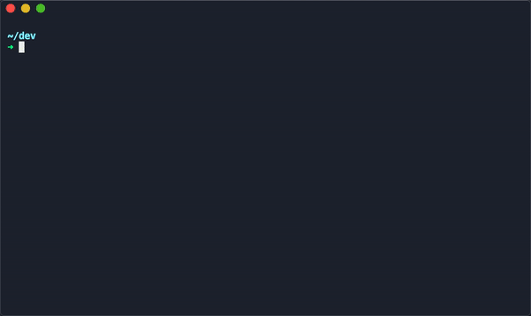

# golf.js

an actually blazing fast 🚀™ node project scaffolder



## usage

```bash
yarn global add golfjs
or
npm install -g golfjs
```

then

```bash
$ golf <project name>
```

## what it does

golf generates all of the generic files you need for a nodejs project based on your environment.

- .editorconfig
- .gitignore
- LICENSE (MIT)
- README.md

it also runs `yarn` or `npm` init (depending on your self) to build a package.json.

---

init'd with [golf](https://github.com/gretzky/golf.js)
